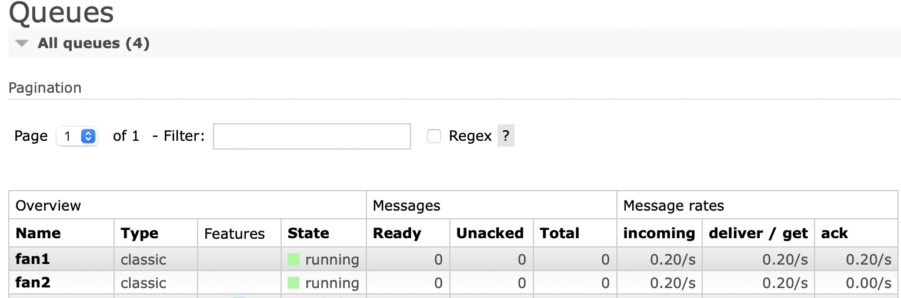

# Overview

## SQL-server

### To start server

1. Download the Postgres-server [here](https://www.postgresql.org).
2. Create a `root`-user as
   seen [here](https://medium.com/coding-blocks/creating-user-database-and-adding-access-on-postgresql-8bfcd2f4a91e).
3. Create a db called `testdb`: `postgres createdb testdb`

### To see results

1. Start the Postgres-interface with `psql`
2. Change to the db: `\c testdb`
3. Show tables: `\dt`
4. Show entries in table: `select * from account`

# Rest-API Overview

Polls can be accessed through `/polls`. Votes can be accessed through `/polls/{pid}/votes` or `/votes`. We originally
thought of not doing a `/votes`-API, but later found out it might make sense anyway.

## GET

```
/polls
```

```
/polls/{pid}
```

```
/polls/{pid}/votes
```

```
/votes
```

```
/votes/{vid}
```

```
/accounts
```

```
/accounts/{id}
```

## DELETE

```
/polls/{pid}
```

```
/votes/{vid}
```

```
/accounts/{id}
```

## PUT

```
/polls/{pid}
```

```
/votes/{vid}
```

```
/accounts/{id}
```

## POST

```
/polls
```

```
/polls/{pid}/votes
```

```
/votes
```

```
/accounts
```

## RabbitMQ




